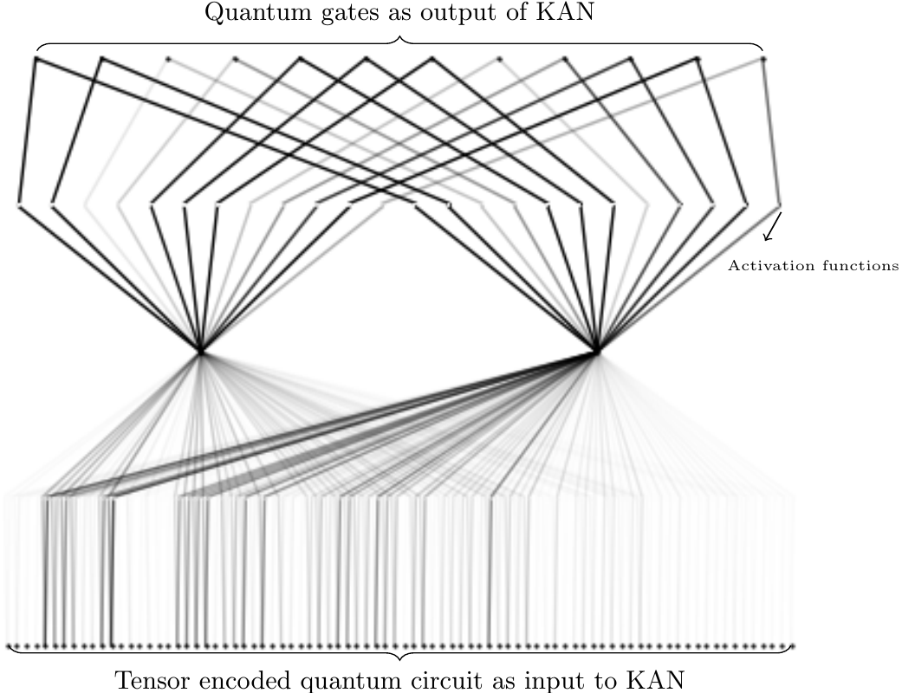
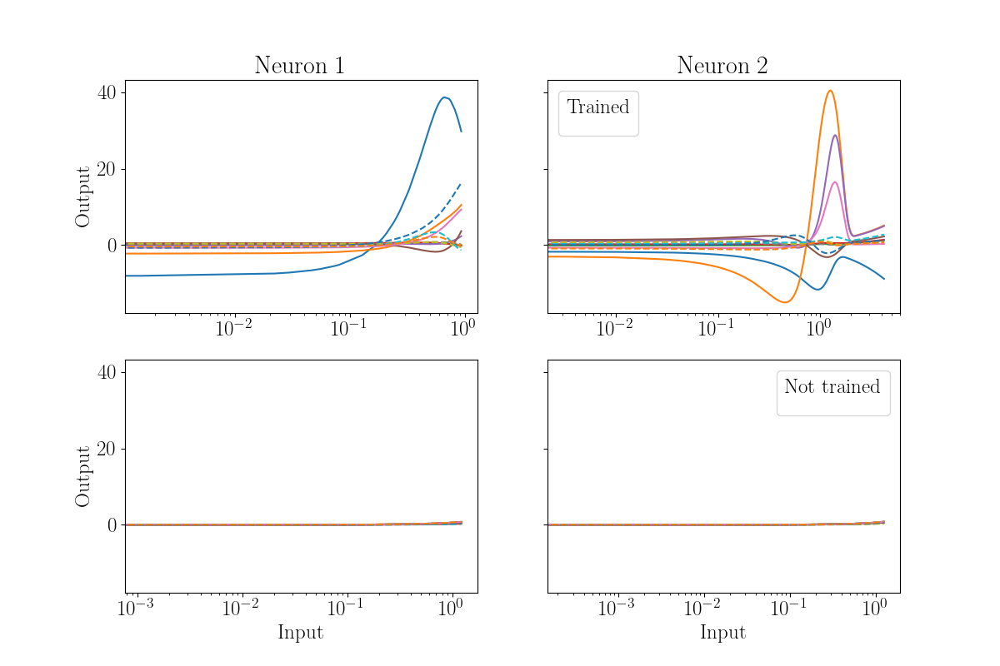

# KANQAS
In this code, which compliments our [KANQAS](https://scirate.com/arxiv/2406.17630), we provide the code that opens up the possibility of harnessing Kolmogorov-Arnold Network for Quantum Architecture Search i.e., namely KANQAS

## Before running the code!
The code was used on Ubuntu GNU/Linux 22.04.4 LTS (64-bit).

For this project, we use Anaconda which can be downloaded from https://www.anaconda.com/products/individual.

Before proceeding further kindly install and activate the environment using the following command:
```
conda env create -f kanqas.yml
conda activate kanqas 
```

## If the above does not work :(
It is recommended to make your own environment using (please check [managing envioenments](https://conda.io/projects/conda/en/latest/user-guide/tasks/manage-environments.html) for details):
```
conda create --name <name-of-your-environment>
```
then 
```
conda activate <name-of-your-environment>
```
and after install pip
```
conda install pip
```
install the following few dependencies listed below:
```
pip install numpy
pip install torch
pip install qiskit-aer
pip install pykan
```
please note that `pykan` module itself inherently requires some specific softwares to run. Hence, after `pykan` you install the following:
```
pip install scikit-learn
pip install pyyaml
pip install matplotlib
pip install tqdm
pip install pandas
```

Phew, you are done now! You are ready to go! So explore and exploit the possibilities with KANQAS!
## We run the noiseless/noisy experiments with:
MLP
```
python main.py --seed 1 --config 2q_bell_state_seed1 --experiment_name "DDQN/"
```

and KAN
```
python main.py --seed 1 --config 2q_bell_state_seed1 --experiment_name "KAQN/"
```

## Configuration of experiment
The configuration for experiments to Bell and GHZ state constructions are in `configuration_files/` folder, where the `DDQN` folder contains Double Deep Q-Network with Multi-Layer Perceptron and `KAQN` is Double Deep Q-Learning with Kolmogorov Arnold Network. 

## Results
The results are saved in the `results/` folder.

## The KAN code
The KAN part of the code is built using the awesome repository [pykan](https://github.com/KindXiaoming/pykan)! Also it is recommended to check the `Author's note` in the pykan git if you are planning to use for other applications!

## The MLP code
The MLP part of the code is built using the [RL-VQE code agent](https://github.com/mostaszewski314/RL_for_optimization_of_VQE_circuit_architectures/blob/main/agents/DeepQ.py) and [RL-VQSD code agent](https://github.com/iitis/RL_for_VQSD_ansatz_optimization/blob/main/agents/DeepQ.py)


# To study the interpretability of KANs
As a motivation for future work towards the interpretability of KAN, we illustrate trained KAN in constructing Bell state

where we use the `[84,2,12]` configuration. The `Tensor encoded quantum circuit as input to KAN` contains 84 entries because the quantum circuit is encoded into $D\times (N\times(N+5))$ dimension tensor, where $D=6$ corresponds to maximum depth. For more details, please check our [paper](https://scirate.com/arxiv/2406.17630). We can see that not all the neurons actively contribute to the choice of action, defined as `Quantum gates as output of KAN`.


Due to the huge dimension of the KAN in the previous picture, the `activation function` is in between the input and the output layers; the activation functions are not visible. Hence in the following illustration, we explicitly show the trend of the `activation function` of the trained KAN


# If you find our repository useful, please cite it as:

```
@misc{kanqas_code,
 author = {Akash Kundu},
 title = {{KANQAS GitHub}},
 year = {2024},
 publisher = {GitHub},
 journal = {GitHub repository},
 howpublished = {\url{https://github.com/Aqasch/KANQAS_code}},
 commit = {}
}
```
